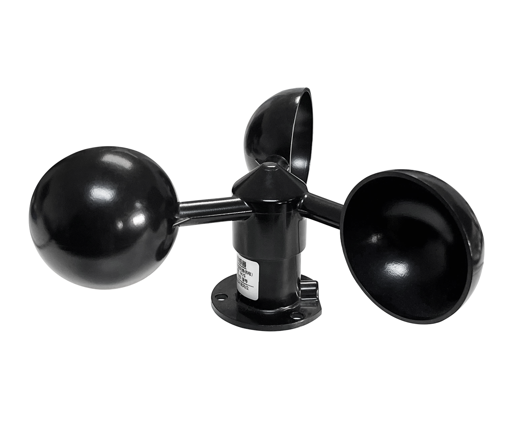
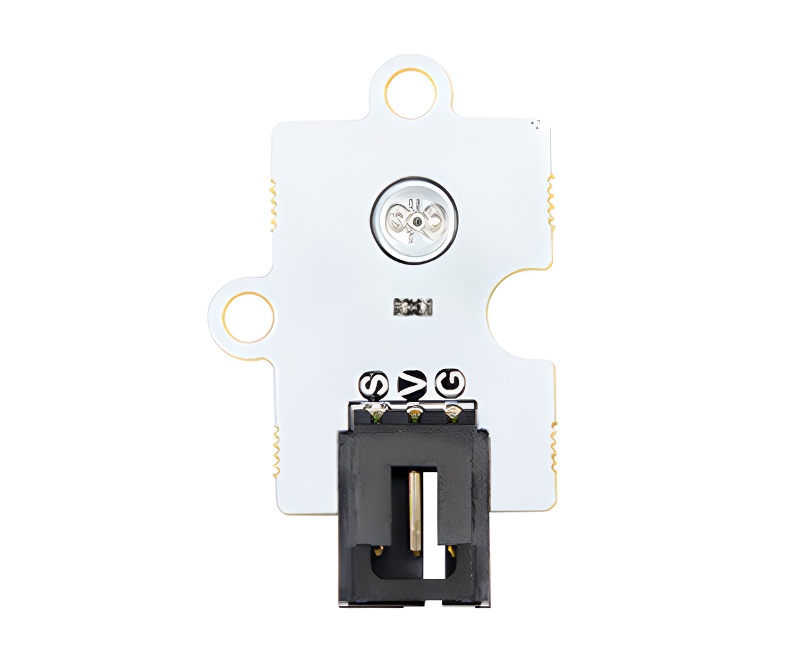
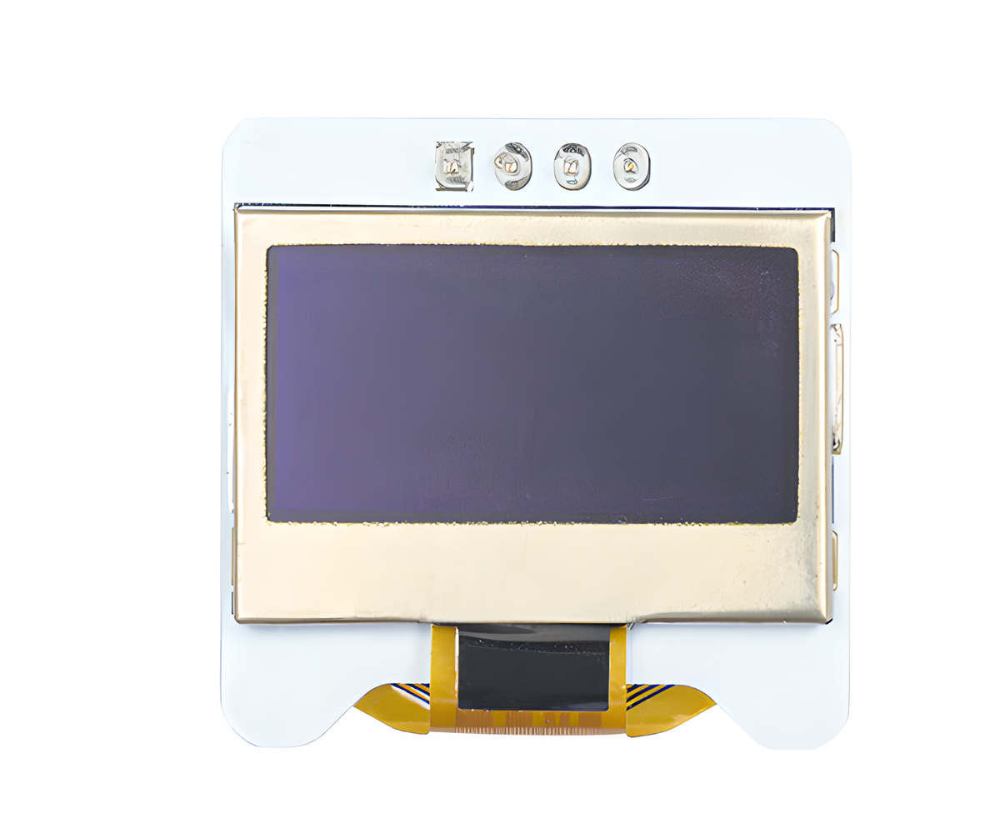

# 硬件介绍

## micro:bit

micro:bit 是一款专为青少年编程教育目的而设计的微型计算机，尺寸只有4cm x 5cm，但它拥有一系列的传感器和 LED 灯，可以用来控制和监测物理世界。

micro:bit 可以通过 USB 线或蓝牙连接到计算机，并使用编程软件进行编程。它支持多种编程语言，包括 Microsoft MakeCode、Python 和 JavaScript 等。学生可以使用这些编程语言来编写代码，控制 micro:bit 上的传感器和 LED 灯，创造各种有趣的项目。

micro:bit 的设计简单易用，适合初学者使用。它可以用于各种教育活动，如编程课程、科学实验和创客活动等。通过使用 micro:bit，学生可以培养创造力、解决问题的能力和团队合作精神。

更多关于 micro:bit 的信息，欢迎访问：[micro:bit 官网](https://microbit.org/)。

[什么是micro:bit](https://support.microbit.org/support/solutions/articles/19000013983-what-is-a-micro-bit-)

## IOT:bit

IOT:bit 扩展板是一款功能丰富的扩展板，专为 micro:bit 设计。下面是更详细的介绍：

**WiFi 模块：**

IOT:bit 板载了 WiFi 模块，使您能够轻松连接到无线网络。通过 WiFi 模块，您可以实现与云平台（如Thingspeak 和 HiveMQ）的快速通信，将数据传输到云端或从云端获取数据。这为您的智能项目提供了广阔的连接和远程控制的可能性。

**RTC 时钟模块：**

IOT:bit 集成了 RTC 时钟模块（实时时钟），它具有精准的计时功能。即使主板断电，独立供电的RTC 模块仍可继续计时。这为您的应用提供了持续准确的时间记录，例如时间戳、定时任务和事件触发等。

**蜂鸣器：**
IOT:bit 包含了一个蜂鸣器，通过它您可以播放旋律、音效或警报声。蜂鸣器能够产生不同频率的声音，为您的项目增加了声音反馈和交互性。

**IO 口扩展：**
IOT:bit 扩展了 micro:bit 上所有可用的 IO 口，并以 GVS 形式引出，方便您与各种 3V 的电子积木模块连接。您可以扩展各种模块，如 LED 灯、光敏传感器、舵机等，以构建更丰富、多样化的智能系统。

IOT:bit 扩展板的功能丰富，能够满足您在智能系统开发中的需求。它提供了 WiFi 连接、RTC 时钟、蜂鸣器和 IO 口扩展等功能，为您的项目带来更多可能性。不仅可以实现数据的快速传输和远程控制，还可以增加音效和各种传感器的接入，让您的智能系统更加智能化和互动性。

更多关于 IOT:bit 的信息请访问：[IOT:bit 物联网扩展板](http://wiki.elecfreaks.com/en/microbit/expansion-board/iot-bit/)。

## 风速传感器

这是一款防水设计的风速传感器，采用Octopus相关产品的标准连接器，方便与其他设备进行连接。它能够根据风速的变化提供相应的电压输出。随着风速的增大，输出电压也随之增大，为用户提供准确的风速测量。该风速传感器可以应用于气象观测、环境监测，可用于测量风速。其防水设计保证了在恶劣环境下的可靠性和耐用性。

关于更多风速传感器的信息，欢迎访问：[八爪鱼系列风速传感器介绍 Wiki 链接](https://wiki.elecfreaks.com/en/microbit/sensor/octopus-sensors/sensor/octopus_ef04083/)。

## 灰尘传感器

灰尘传感器是一种空气质量传感器，用于检测空气中的微尘颗粒物浓度。

它使用红外光散射原理来测量颗粒物的浓度。传感器内部包含一个红外光源和一个光敏元件。当空气中的颗粒物通过传感器时，它们会散射红外光，光敏元件会测量到散射光的强度。根据散射光的强度，传感器可以估计出空气中颗粒物的浓度。

灰尘传感器具有高灵敏度和快速响应的特点。它可以检测直径在0.5到2.5微米之间的颗粒物，这些颗粒物通常是空气中最危险的微尘颗粒物，如细菌、花粉、烟雾等。传感器输出的电压信号与颗粒物的浓度成正比。

这种传感器通常用于空气净化器、空气质量监测设备和工业环境监测等领域。它可以帮助人们了解周围空气的质量，并采取相应的措施来改善空气质量。

关于更多灰尘传感器的信息，欢迎访问：[八爪鱼系列灰尘传感器介绍 Wiki 链接](http://wiki.elecfreaks.com/en/microbit/sensor/octopus-sensors/sensor/octopus_ef11083/)。

## 温湿度传感器

温湿度传感器是一种用于测量和监测环境中温度和湿度的设备。它能够提供精确的温度和湿度数据，帮助人们了解和控制环境条件。这种传感器在许多领域有广泛应用，包括气象观测、室内环境监测、农业、仓储管理和自动化控制系统等。

温湿度传感器能够提供实时的温度和湿度信息，帮助用户监测和调节环境条件，从而改善舒适度、提高生产效率和保护物品的质量。温湿度传感器的广泛应用使其成为现代生活中不可或缺的重要组成部分。

关于更多温湿度传感器的信息，欢迎访问：[八爪鱼系列温湿度传感器介绍 Wiki 链接](https://wiki.elecfreaks.com/en/microbit/sensor/octopus-sensors/sensor/octopus_ef04019/)。

## 紫外线传感器

紫外线传感器是一种用于检测和测量环境中紫外线辐射的设备。它能够感知紫外线的强度并将其转化为电信号输出。紫外线传感器在许多应用领域具有重要作用，包括环境监测、紫外线辐射安全、医疗设备和消费电子产品等。该传感器通过感光元件或光敏材料来捕捉紫外线，然后将光信号转化为电信号进行处理和分析。它可以提供准确的紫外线强度测量，帮助用户了解环境中紫外线的水平，并采取适当的防护措施。紫外线传感器具有高灵敏度、快速响应和稳定性强的特点，是保护人类健康和安全的重要工具。

关于更多紫外线传感器的信息，欢迎访问：[八爪鱼系列紫外线传感器介绍 Wiki 链接](https://wiki.elecfreaks.com/en/microbit/sensor/octopus-sensors/sensor/octopus_ef04093/)。

## OLED显示屏

0.96寸 OLED 显示模块采用 SSD1306 驱动芯片，有128x64个自发光的白色像素点。具有功耗低、对比度高等优点，可用于许多显示应用，例如：各类传感器的数值显示；mini 小游戏机；智能穿戴设备等。

更多关于碰撞传感器的信息请访问：[OLED显示屏](https://wiki.elecfreaks.com/en/microbit/sensor/octopus-sensors/output/octopus_ef03155)。
