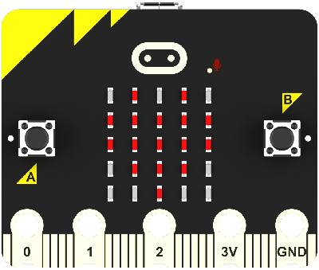
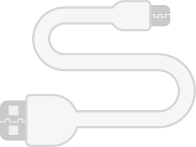
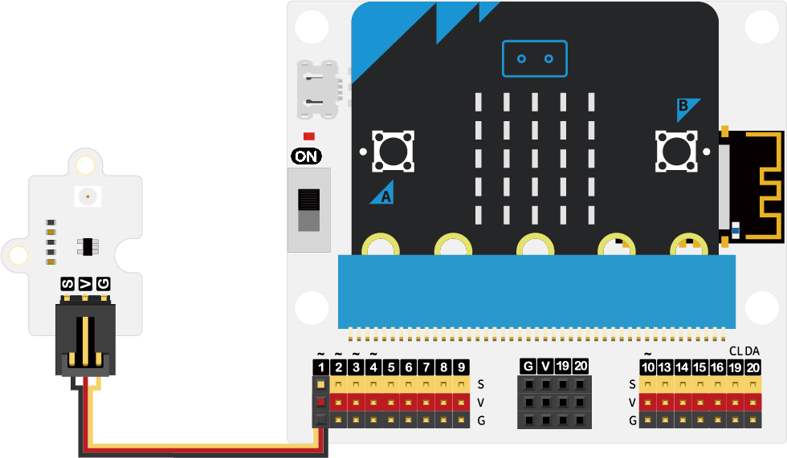
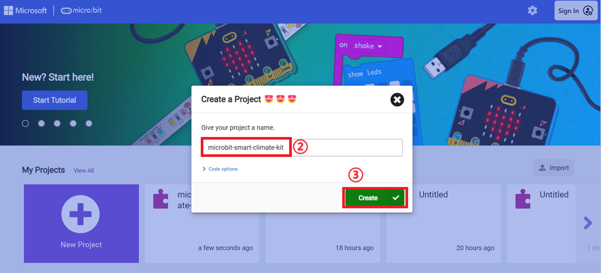
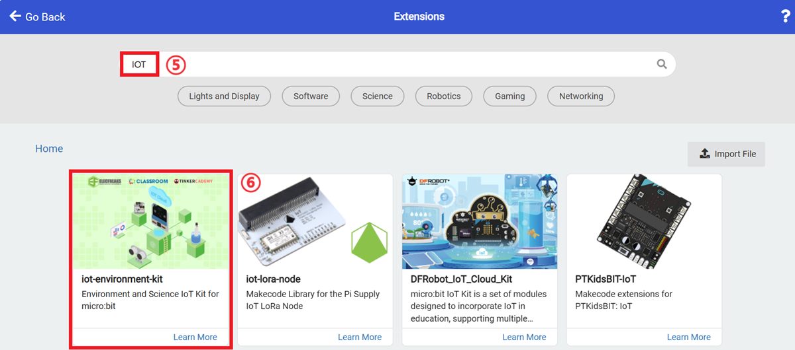
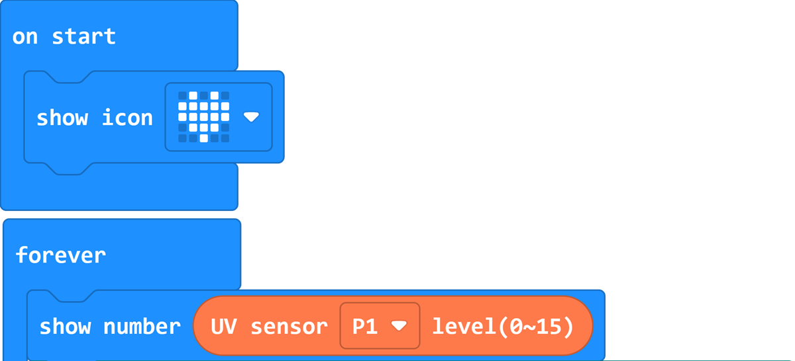
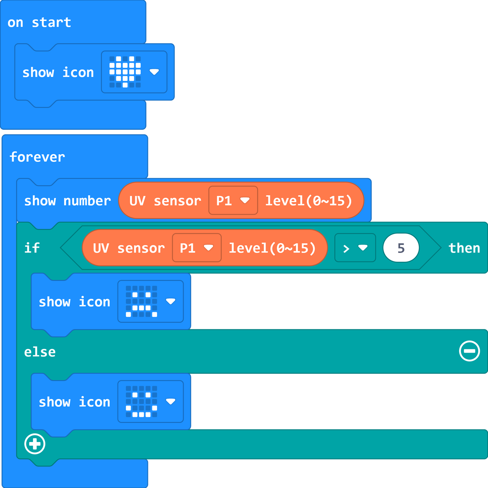
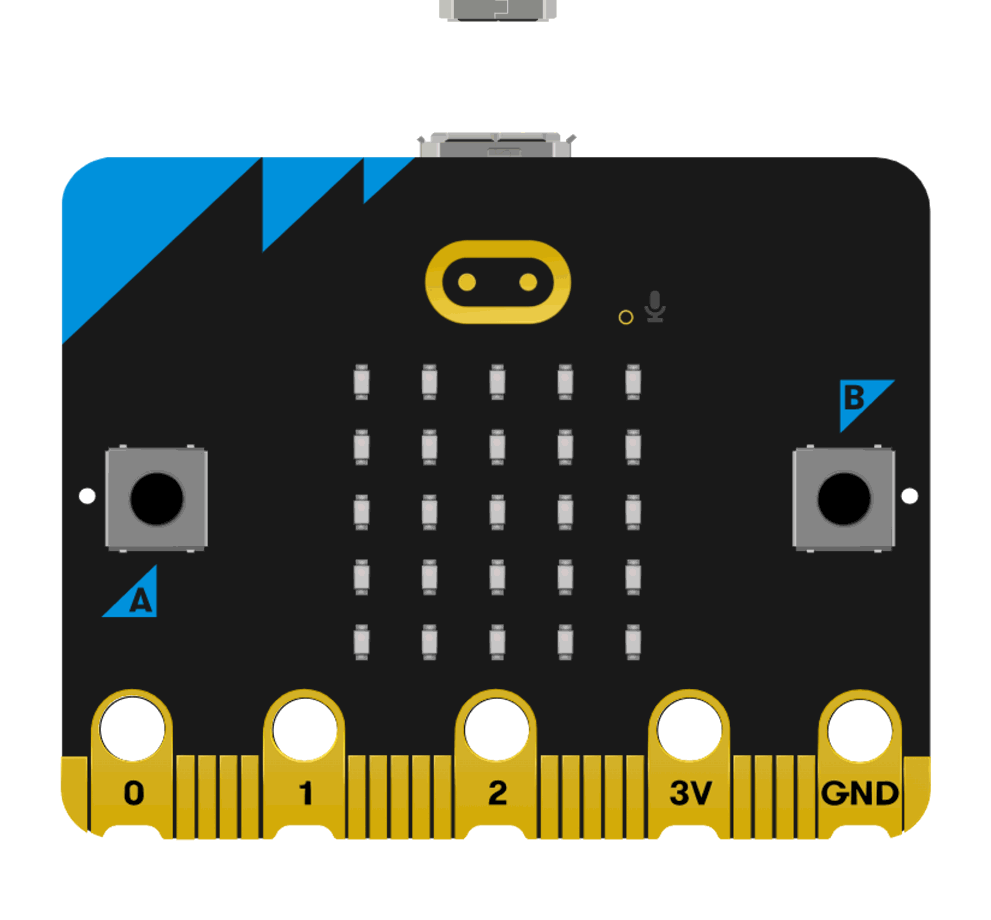
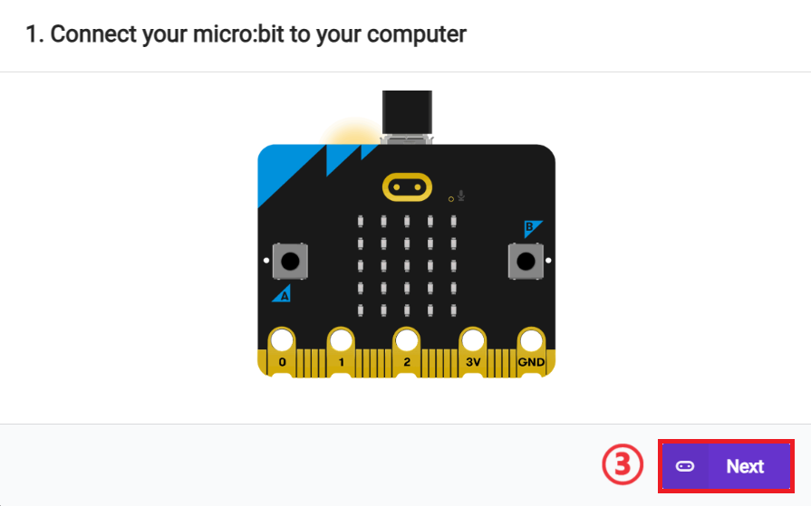
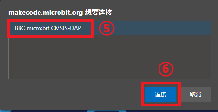

# 案例一：紫外线辐射监测装置

## 简介

本项目旨在引导学生使用智能气候套装中的UV传感器和micro:bit微控制器制作一个紫外线等级显示装置。通过柱状图的方式，该装置可以显示当前的紫外线等级，提醒人们采取适当的防护措施。通过这个项目，学生将学习如何使用传感器和微控制器来收集数据并进行可视化展示。

## 教学目标

了解基本的机器人控制概念。

## 教学准备

在开始教学之前，请确保您已经准备好以下必要的材料：

| 图片 | 名称 |
| :-: | :-: |
|  | 智能气候套装 |
|  | micro:bit V2 |
|  | 个人电脑（PC） |
|  | USB 数据线 |

这些材料将为您提供一个完整的体验，确保您可以顺利地进行后续的操作和学习。如果您已准备好以上内容，我们可以继续进入下一步。

## 教学过程

### 课程引入

你是否曾经想过如何通过编程来制作一个智能装置，能够帮助我们监测紫外线的强度，并提醒我们采取适当的防护措施呢？编程是一种让计算机或设备按照我们的指令执行任务的方式。在本节课中，我们将一起探索如何使用编程和传感器技术制作一个智能紫外线等级显示装置。

我们将使用智能气候套装中的UV传感器和micro:bit微控制器，通过编程将传感器的数据转化为可视化的紫外线等级显示。这个装置能够实时监测紫外线的强度，并通过柱状图的形式向我们展示当前的紫外线等级。

准备好了吗？现在，让我们一起踏上这个有趣的学习旅程，探索如何利用编程和传感器技术制作一个智能紫外线等级显示装置吧！

### 探究活动

1. 如何编写一个程序，使紫外线等级显示装置能够读取UV传感器的数据并将其转化为紫外线等级？

2. 学习如何使用micro:bit上的编程环境，编写代码来读取传感器数据。

- 理解如何将传感器测量的数值映射到对应的紫外线等级范围。

- 如何设计一个柱状图的显示界面，以直观地展示当前的紫外线等级？

3. 探索如何使用micro:bit上的LED灯或其他输出功能来显示柱状图。

- 学习如何根据紫外线等级的不同，控制LED灯的亮度或显示不同的图案。

- 除了紫外线等级显示，还能通过编程实现其他有趣的功能吗？

4. 探索如何添加声音或报警功能，以提醒人们注意紫外线强度。

- 学习如何在显示装置上添加按钮或触摸传感器，以实现交互功能。

### 硬件连接

将UV传感器连接到P1接口。

### 代码编程

*** 添加软件库 ***

进入“[makecode.microbit.org](makecode.microbit.org)”，点击新建项目。

在弹出窗口输入项目名称并点击“创建”。

点击代码抽屉中的“扩展”。

在弹出界面输入“IOT”，按下回车键进行搜索，并选择加载IOT软件库。

*** 示例代码 ***

1. 当开机时显示爱心图标。

2. 显示当前连接到P1接口的紫外线强度。

3. 当紫外线强度大于5时，显示哭泣图标，否则显示笑脸图标。

请参考程序连接：[https://makecode.microbit.org/_3XE2YF8hKbjs](https://makecode.microbit.org/_3XE2YF8hKbjs)

你也可以通过以下网页直接下载程序。

    <iframe
        src="https://makecode.microbit.org/_3XE2YF8hKbjs"
        frameborder="0"
        sandbox="allow-popups allow-forms allow-scripts allow-same-origin"
        style={{
            position: 'absolute',
            width: '100%',
            height: '100%',
        }}
    />

*** 下载程序 ***

使用USB线连接PC和micro:bit V2。

连接成功后，电脑上会识别出一个名为`MICROBIT`的盘符。

点击左下角的，选择`Connect Device`。

点击。

点击。

在弹出窗口选择`BBC micro:bit CMSIS-DAP`，然后选择连接，至此，我们的micro:bit就已经连接成功。

点击下载程序。

### 团队合作与展示

学生分成小组，共同完成案例的制作和程序编写。

鼓励学生之间相互合作、交流和分享经验。

每个小组有机会向其他小组展示他们制作的案例，并演示。

*** 预期效果：连接电源后，micro:bit的LED矩阵先显示爱心，然后根据当前紫外线强度等级显示笑脸或者哭脸图标。 ***

（GIF动图）

### 总结与反思

回顾课程内容，提醒学生掌握了哪些知识和技能。

引导学生讨论他们在制作过程中遇到的问题和困难，以及如何解决这些问题。

引导学生思考不同紫外线水平下的健康风险，并探讨防晒措施的重要性。

## 扩展知识

不同紫外线（UV）水平下存在不同的健康风险，因此采取防晒措施非常重要。以下是不同紫外线水平下的健康风险和防晒措施的重要性：

低紫外线水平（UV指数1-2）：

健康风险：低紫外线水平下的健康风险相对较低，但仍存在日常紫外线暴露的风险。

防晒措施：尽管低，但仍建议进行基本的防晒措施。使用防晒霜、戴帽子、佩戴太阳镜和遮阳衣以保护皮肤和眼睛。

中等紫外线水平（UV指数3-5）：

健康风险：中等紫外线水平下，皮肤和眼睛受到更高程度的紫外线损伤的风险增加。

防晒措施：采取更全面的防晒措施非常重要。使用广谱防晒霜，含有SPF（防晒因子）和UVA/UVB保护，涂抹在暴露的皮肤上。戴宽边帽子、太阳镜和遮阳衣以提供额外的保护。

高紫外线水平（UV指数6-7）：

健康风险：高紫外线水平下，暴露在太阳下的时间较长可能导致皮肤晒伤、日光性皮炎、日光性皮肤衰老等。

防晒措施：采取强化的防晒措施至关重要。选择高SPF值的广谱防晒霜，定期涂抹，特别是在户外活动时。选择遮阳性能好的衣物，避免暴露在强烈阳光下。

非常高紫外线水平（UV指数8或更高）：

健康风险：非常高紫外线水平下，暴露在太阳下的时间较短即可导致严重的皮肤晒伤、日光性角膜炎、皮肤癌等。

防晒措施：采取严格的防晒措施以最大程度地保护皮肤和眼睛。尽量避免在强烈阳光下暴露，寻找阴凉处。使用高SPF值的广谱防晒霜，戴宽边帽子、太阳镜和遮阳衣。

无论紫外线水平如何，防晒措施对于预防皮肤损伤、晒伤和皮肤癌等都至关重要。养成定期使用防晒霜、遮阳衣和其他防晒措施的习惯，以保护自己免受紫外线的伤害。
