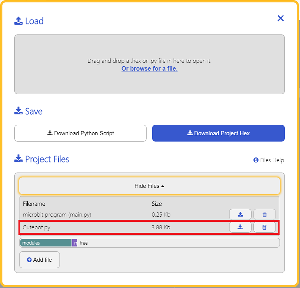

# Cutebot智能赛车python使用示例


---


### 添加python文件
下载压缩包并解压[EF_Produce_MicroPython-master](https://github.com/elecfreaks/EF_Produce_MicroPython/archive/refs/heads/master.zip)
打开[Python editor](https://python.microbit.org/v/2.0)


为了给酷比特智能赛车编程，我们需要添加Cutebot.py这个文件。点击Load/Save，然后点击Show Files（1）下拉菜单，再点击Add file在本地找到下载并解压完成的EF_Produce_MicroPython-master文件夹，从中选择Cutebot.py这个文件添加进来。




## API

`CUTEBOT(object)`

创建对象。

`set_motors_speed(self, left_wheel_speed: int, right_wheel_speed: int)`

设置左右轮的电机速度：

        `left_wheel_speed: int`左轮速度-100～100
        `right_wheel_speed: int`右轮速度-100～100。

`set_car_light(self, light: int, R: int, G: int, B: int)`

设置车头灯颜色:

        `light`:选择车灯
        `R`:R通道颜色0-255`
        `G`:G通道颜色0-255`
        `B`:B通道颜色0-255`


`get_distance(self, unit: int = 0)`

车头超声波读取距离:

        `unit`检测距离单位:` 0 `厘米,` 1 `英尺


`get_tracking(self)`

返回当前巡线头状态:

        return:`00` 均在白色
               `10` 左黑右白
               `01` 左白右黑
               `11` 均在黑色


`set_servo(self, servo, angle)`

选择伺服电机并且设置角度/速度:

        `servo (number)`选择第几个舵机（伺服电机）1,2
        `angle (number)`设置舵机角度 0~180


### 示例代码
### 示例一     让小车全速前进
```
from microbit import *
from Cutebot import *
ct = CUTEBOT()
ct.set_motors_speed(100, 100)

```
### 结果
- 酷比特小车左轮速度为100，右轮速度为100，全速前进。


### 示例二    点亮车头LED灯
```
from microbit import *
from Cutebot import *
ct = CUTEBOT()
ct.set_car_light(left, 0, 90, 90)
ct.set_car_light(right, 200, 200, 0)
#设置左边车头灯为R:0，G:90,B:90;设置右边车头灯为R:200，G:200,B:0
```
### 结果
- 酷比特小车两个车头灯分别亮不同的颜色。

### 示例三    超声波避障小车
```
from microbit import *
from Cutebot import *

dis = CUTEBOT()

while(True):
    i = dis.get_distance(0)
    if i>3 and i<20:
        dis.set_motors_speed(-50, 50)
        sleep(500)
    else:
        dis.set_motors_speed(50, 50)
```
### 结果
- 酷比特小车在行驶过程中如果遇到障碍物，则立即转向。

### 示例四    巡线行驶
```
from microbit import *
from Cutebot import *

dis = CUTEBOT()

while(True):
    i = dis.get_tracking()
    if i == 10:
        dis.set_motors_speed(10, 50)
    if i == 1:
        dis.set_motors_speed(50, 10)
    if i == 11:
        dis.set_motors_speed(25, 25)
```
### 结果
- 酷比特小车巡线行驶。

### 示例五    控制舵机
```
from microbit import *
from Cutebot import *

dis = CUTEBOT()

while(True):
    dis.set_servo(0,180)
    sleep(1000)
    dis.set_servo(0,0)
    sleep(1000)
```
### 结果
- 酷比特小车S1端口连接的舵机往复转动。


## FAQ

关于程序报错信息：

 |ValueError|错误内容|
 |:---:|:---:|
 |speed error,-100~100|小车的左轮或者右轮的速度超出设定阈值|
 |RGB is error|小车的车头灯颜色参数超出设定阈值|
 |select servo error,1,2|小车的舵机接口参数设置错误|
 |angle error,0~180|舵机旋转角度设置错误|


## 相关案例
---

## 技术文档
---
