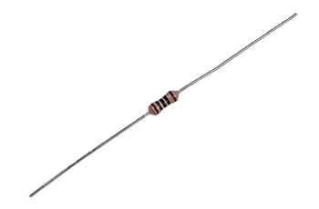

# LED


## 简介
LED 灯是城市建设的重要组成部分，比如交通路口的红绿灯、商店的广告牌、公园路标灯光、商场走廊灯光等等，其应用非常广泛。这节课程，将使用 Pico:ed 控制2颗 LED 灯实现交替闪烁效果。

## 元件清单

### 硬件：
1 × Pico:ed
1 × USB线
1 × 面包板扩展板
1 × 面包板83×55mm
2 × LED
2 × 100欧姆电阻
若干杜邦线


## 主要元件介绍

### 面包板扩展板
面包板扩展板可以在面包板上扩展出 Pico:ed 的所有引脚，方便我们在面包板上制作简单的电路。


下面这张图片显示了如何将面包板扩展板插入到面包板上。面包板扩展板可以适用于各种规格的面包板。


### LED
LED 是 Light Emitting Diode（发光二极管）的缩写。这是一种半导体二极管。它可以将电能转换成光能。当电流经过的时候，它就会发光。


如果你仔细看看 LED，你就会发现它的两个特点。一个是它的引脚的长度不一致，另一个是LED的一侧是扁平的，而不是圆柱形。这些特征可以告诉你哪个引脚是阳极（正极），哪个引脚是阴极（负极）。长一些的引脚连接正极供电（3.3v），带有扁平一侧的引脚连接负极。

### 电阻
电阻是一种用于控制电流的元件。它可以限制所连接的电路的电流。在我们的实验中，我们使用了100欧姆的电阻。如果不限电流的话，就会损坏 LED 灯。



想通过色环来识别电阻的阻值吗？你可以阅读这篇文章：[How to Identify Color Circle Resistance Value](https://www.elecfreaks.com/blog/how-to-identify-color-circle-resistance-value.html/).

## 实验步骤

### 硬件连接
根据下面的图片将你的元件连接起来：
1.将 LED 灯的短引脚与 GND 连接；
2.将 LED 灯的长引脚通过电阻，与 P0 口与 P1 口连接。


连接完成后如图：


## 程序编程
编程环境准备请参考：[编程环境介绍](https://www.yuque.com/elecfreaks-learn/picoed/er7nuh)

### 代码示例：
```python
# 导入程序所需要的模块
import board
from digitalio import *
from time import *

# 设置LED灯连接的引脚和引脚方向
led_0 = DigitalInOut(board.P0_A0)
led_1 = DigitalInOut(board.P1_A1)
led_0.direction = Direction.OUTPUT
led_1.direction = Direction.OUTPUT

# 设置2颗LED灯的状态在亮、灭之间切换
while True:
    led_0.value = True
    led_1.value = False
    sleep(1)
    led_0.value = False
    led_1.value = True
    sleep(1)
```

### 代码详解

1. 导入程序所需要的支持模块。`board`模块是引脚名称的通用容器，可以通过`board`模块指定要使用的引脚，`digitalio`模块包含提供对基本数字 IO 的访问的类。`time`模块包含对时间设置的函数。
```python
import board
from digitalio import *
from time import *
```

2. 设置2颗 LED 灯所连接的引脚以及引脚方向。

```python
led_0 = DigitalInOut(board.P0_A0)
led_1 = DigitalInOut(board.P1_A1)
led_0.direction = Direction.OUTPUT
led_1.direction = Direction.OUTPUT
```
如果你所使用的引脚不是 P0_A0 和 P1_A1，那么可以在 Thonny 编辑器下方的 shell 窗口中输入以下代码并回车查看其他引脚的编号。

```python
>>> import board
>>> help(board)
object <module 'board'> is of type module
  __name__ -- board
  board_id -- elecfreaks_picoed
  BUZZER_GP0 -- board.BUZZER_GP0
  I2C0_SDA -- board.BUZZER_GP0
  I2C0_SCL -- board.I2C0_SCL
  BUZZER -- board.BUZZER
  BUZZER_GP3 -- board.BUZZER
  P4 -- board.P4
  P5 -- board.P5
  ...
```

3. 使用无限循环设置2颗 LED 灯的状态为亮、灭。其中可以使用 `1`、`0`代替`True`、`False`设置 LED 灯的状态为亮、灭。

```python
while True:
    led_0.value = True  # 1
    led_1.value = False  # 0
    sleep(1)
    led_0.value = False  # 0
    led_1.value = True  # 1
    sleep(1)
```

## 实验结果
你可以看到两颗 LED 灯交替闪烁。如果不是这样的情况，请返回之前的步骤，检查你的操作。


## 思考
如果我们想控制3颗 LED 灯，让它们实现路口红绿灯的效果，那么我们该如何设计电路和编程呢？

## 常见问题

## 更多信息，欢迎访问：
[恩孚科技官方文档](https://www.elecfreaks.com/learn-en/)
