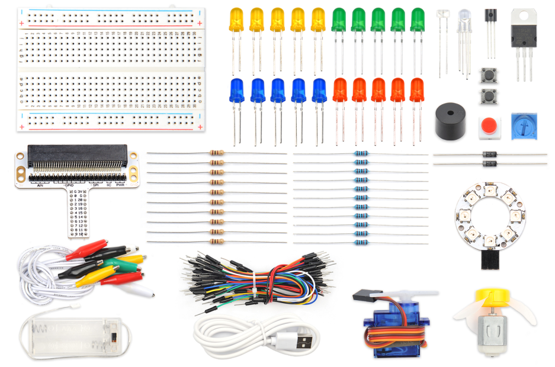
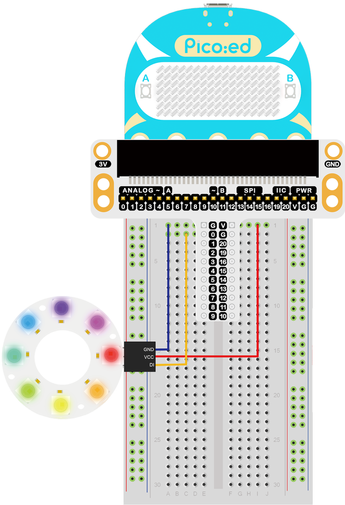
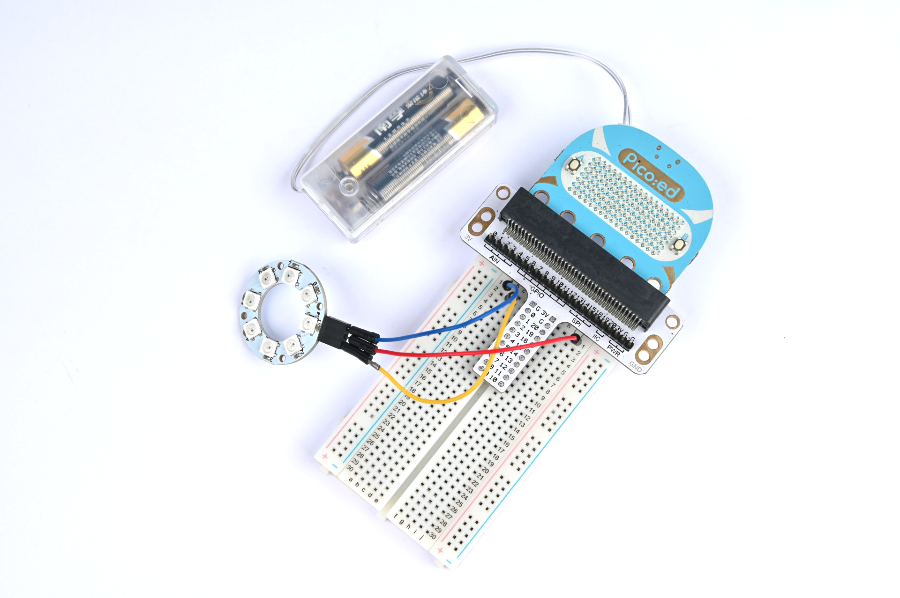

# 七彩灯环


## 简介
LED 七彩灯环是基于 ws2812b 灯珠。它的最大特点是单 IO 控制与无限级联。在这节课程中，我们将用 Pico:ed来驱动 LED 七彩灯环实现色彩缤纷的效果。

## 元件清单

### 硬件：
1 × Pico:ed
1 × USB线
1 × 面包板扩展板
1 × 面包板 83 × 55mm
1 × LED七彩灯环（8颗灯珠）
若干杜邦线



## 主要元件介绍

### LED七彩灯环（8颗灯珠）


LED 七彩灯环（8颗灯珠）是由8颗 ws2812b 灯珠级联而成的灯环，ws2812b 是一个集控制电路与发光电路于一体的智能外控 LED 光源，其外型与一个 5050LED 灯珠相同。
像素点内部包含了智能数字接口数据锁存信号整形放大驱动电路，还包含有高精度的内部振荡器和12V高压可编程定电流控制部分，有效保证了像素点光的颜色高度一致。
数据协议采用单线归零码的通讯方式，像素点在上电复位以后，DIN 端接受从控制器传输过来的数据，首先送过来的24bit数据被第一个像素点提取后，送到像素点内部的数据锁存器，剩余的数据经过内部整形处理电路整形放大后通过 DO 端口开始转发输出给下一个级联的像素点，每经过一个像素点的传输，信号减少24bit。像素点采用自动整形转发技术，使得该像素点的级联个数不受信号传送的限制，仅仅受限信号传输速度要求。
LED 具有低电压驱动，环保节能，亮度高，散射角度大，一致性好，超低功率，超长寿命等优点。将控制电路集成于 LED 上面，电路变得更加简单，体积小，安装更加简便。

## 实验步骤

### 硬件连接
根据下面的图片将你的元件连接起来：
1.将七彩灯环的信号线与扩展板P0口连接起来



注意：灯环引出了两组线，一组是DI,另一组是DO，我们应当连接DI这一组。

连接完成如下图所示：




## 程序编程
编程环境准备请参考：[编程环境介绍](https://www.yuque.com/elecfreaks-learn/picoed/er7nuh)

### 代码示例：
```python
# 导入程序所需要的模块
import board
import random
import neopixel_write
import digitalio
import time

# 设置七彩灯环的引脚和引脚方向
pin = digitalio.DigitalInOut(board.P0_A0)
pin.direction = digitalio.Direction.OUTPUT

# 初始化列表，用于存储灯环的RGB数值
rings = [0, 0, 0, 0, 0, 0, 0, 0, 0, 0, 0, 0, 0, 0, 0, 0, 0, 0, 0, 0, 0, 0, 0, 0]

# 循环改变七彩灯环每个灯的RGB数值
while True:
    for i in range(len(rings)):
        rings[i] = random.randint(0,255)
    pixel_off = bytearray(rings)
    neopixel_write.neopixel_write(pin, pixel_off)
    time.sleep(0.1)
```

### 代码详解

1. 导入程序所需要的支持模块。`board`模块是引脚名称的通用容器，可以通过`board`库指定要使用的引脚，`digitalio`模块包含提供对基本数字IO的访问的类。`time`模块包含对时间设置的函数，`random`模块包含提供创建随机数的函数，`neopixel_write`模块包含一个辅助方法来写出 800khz neopixel 协议中的字节。
```python
import board
import random
import neopixel_write
import digitalio
import time
```

2. 设置七彩灯环的引脚和引脚方向。
```python
pin = digitalio.DigitalInOut(board.P0_A0)
pin.direction = digitalio.Direction.OUTPUT
```
如果你所使用的引脚不是 P0_A0 和 P1_A1，那么可以在 Thonny 编辑器下方的 shell 窗口中输入以下代码并回车查看其他引脚的编号。
```python
>>> import board
>>> help(board)
object <module 'board'> is of type module
  __name__ -- board
  board_id -- elecfreaks_picoed
  BUZZER_GP0 -- board.BUZZER_GP0
  I2C0_SDA -- board.BUZZER_GP0
  I2C0_SCL -- board.I2C0_SCL
  BUZZER -- board.BUZZER
  BUZZER_GP3 -- board.BUZZER
  P4 -- board.P4
  P5 -- board.P5
  ...
```

3. 初始化列表，用于存储灯环的 RGB 数值
```python
rings = [0, 0, 0, 0, 0, 0, 0, 0, 0, 0, 0, 0, 0, 0, 0, 0, 0, 0, 0, 0, 0, 0, 0, 0]
```

4. 循环改变七彩灯环每个灯的 RGB 数值
```python
while True:
    for i in range(len(rings)):
        rings[i] = random.randint(0,255)
    pixel_off = bytearray(rings)
    neopixel_write.neopixel_write(pin, pixel_off)
    time.sleep(0.1)
```

## 实验结果
我们可以看到 LED 七彩灯环实现了色彩缤纷的效果。


## 思考
想象七彩灯环是一只大眼睛，让灯环显示眨眼睛的效果，那么我们该如何设计电路与编程？

## 常见问题

## 更多信息，欢迎访问：
[恩孚科技官方文档](https://www.elecfreaks.com/learn-en/)
