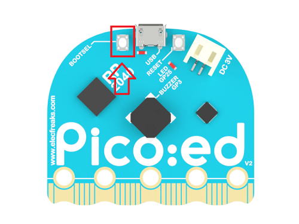
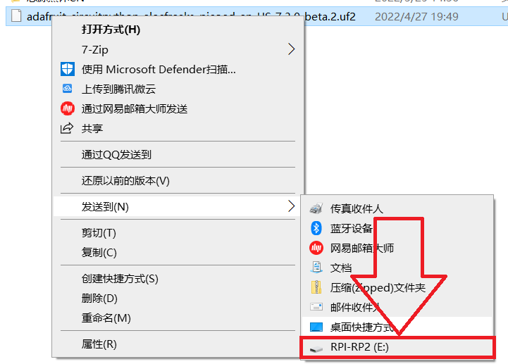
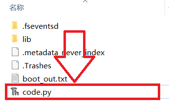

# 固件安装

下载Pico:ed的固件：[Pico:ed固件](https://circuitpython.org/board/elecfreaks_picoed/)。
下载完成后，按下Pico:ed背面的固件下载按钮。

在按下固件下载按钮的情况下，插入USB数据线，当电脑端出现一个名称为RPI-RP2的盘符即可松开固件下载按钮。

将下载下来的固件发送到打开名称为RPI-RP2的盘符中。

等固件下载成功后pico:ed会自动重新连接，连接完成后为一个名称为CIRCUITPY的盘符。

下载成功后即可在CIRCUITPY中code.py文件中进行编程。

## FAQ：

### 如何获得最新版本的固件？
1.点击链接进入circuitpython官网的Pico:ed的固件下载页面：[https://circuitpython.org/board/elecfreaks_picoed/](https://circuitpython.org/board/elecfreaks_picoed/)。
2.点击下拉箭头，选择对应的语言并下载即可。

### 如何查看Pico:ed当前的固件版本？
打开编程软件Thonny，点击View，勾选打开shell视图，通过USB线将Pico:ed连接至电脑，即可查看当前的固件版本。

如何下载并安装Thonny，请查看：[下载并安装编程软件](https://www.yuque.com/elecfreaks-learn/picoed/ggnxx2)
