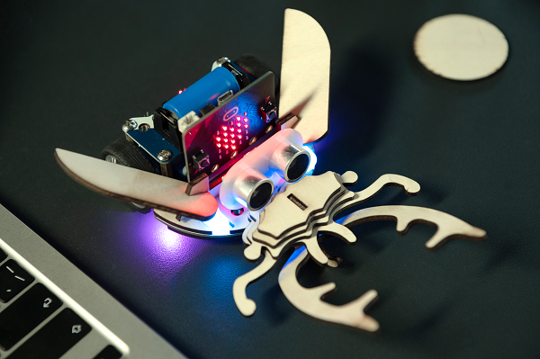
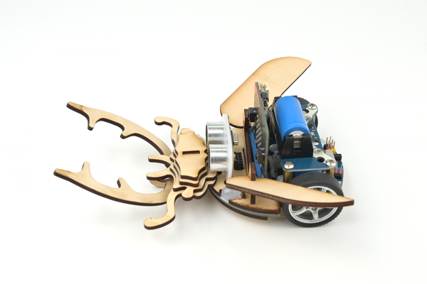

# 独角仙

独角仙大量出现于6~8月，具有趋光性，多为昼出夜伏，白天常常聚集在青刚栎流出树液处，或是在光腊树上也常出现聚集上百只独角仙的盛况，到了晚上，在山区有路灯处，也往往可以发现他们的踪迹。他们主要以树木伤口处的汁液，或熟透的水果为食，对作物林木基本不造成危害。

## 使用材料

[TOOCA L1 Laser Engraver](https://www.elecfreaks.com/elecfreaks-tooca-laser-1.html)

[Smart Cutebot Kit](https://www.elecfreaks.com/micro-bit-smart-cutebot.html)

2.8mm椴木板

## 相关参数

|Model|TOOCA L1 Laser Engraver|
|:-------:|:-------:|
|耗材材质|椴木板|
|厚度|2.8mm|
|功率|100%|
|速度|240mm/min|
|通过次数|3|

注意：本案例以2.8mm的椴木板为例，如果需要使用不同厚度或者使用不同的材料，请自行修改图纸并参考TF卡中的`Recommended parameter`修改软件的参数。

## 图纸下载链接

[Cutebot独角仙..dxf](https://minhaskamal.github.io/DownGit/#/home?url=https://github.com/elecfreaks/learn-en/blob/master/tooca-laser-1/file/Cutting/Cutebot-Unicorn/Cutebot-Unicorn.dxf)

Please refer to the software operation method: [Get Started Quickly](http://)

## 效果展示

