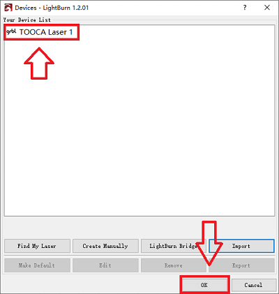
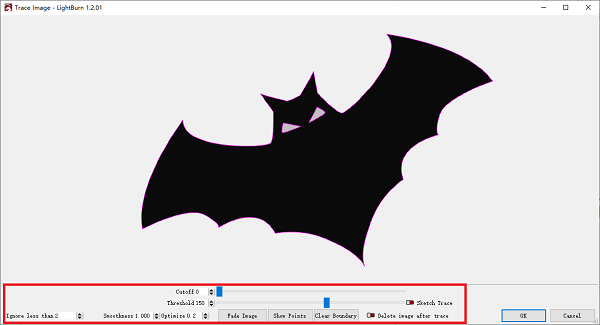
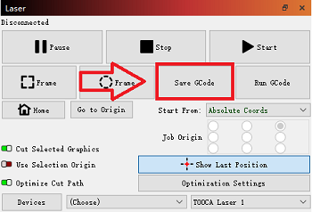

# LightBurn-图像追踪

1.双击.exe文件安装LightBurn软件（TF卡内的安装程序仅兼容Windows 64位系统，其它版
本请访问官网https://lightburnsoftware.com/下载。

备注：该软件免费试用期为1个月，购买序列号详情请访问https://lightburnsoft-
ware.com/collections/frontpage/products/lightburn-gcode

2. 安装成功后，双击打开LightBurn软件，点击“Import”导入TF卡中的.lbdev配置文件。

3. 导入后在设备列表中既有对应机器，选中机器，点击OK即配置成功。

4. 点击“Edit-Setting”，选择“mm/min”，点击OK。

5. 点击“File-Import”导入图片，然后设置图片的位置、尺寸以及旋转角度。

6. 右键单击图像，选择Trace Image设置图像效果，然后点击OK。

7. 设置合适的功率%、速度以及次数。
备注：功率%越大，或速度越慢，雕刻效果越深；功率%越小，或速度越快，雕刻效果越浅。功率%一般调节Power
Max即可。配套的椴木板雕刻推荐参数：最小功率-5.00 最大功率-70.00 速度（mm/m）-6000.

8. 最后点击保存GCode将雕刻文件保存至TF卡。

备注：请确保导出来的文件格式为.gcode，其它格式例如.gc/.nc将不能被雕刻机识别。

9. 此外，您也可以通过Type-C连接雕刻机，实时雕刻。更多详细的软件使用教程请参考
https://lightburnsoftware.github.io/NewDocs/
