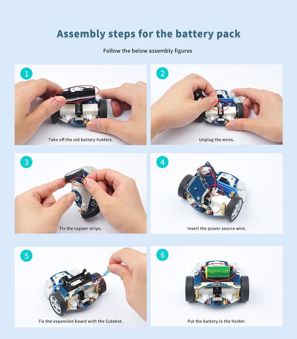
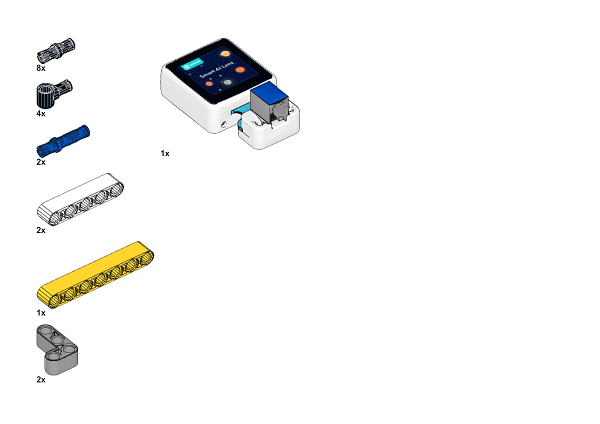
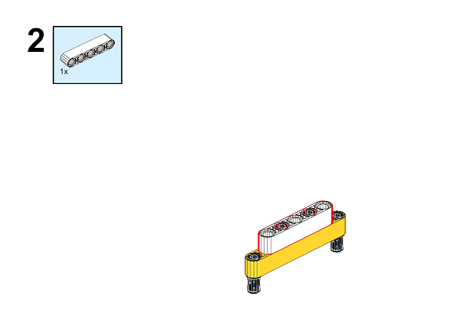
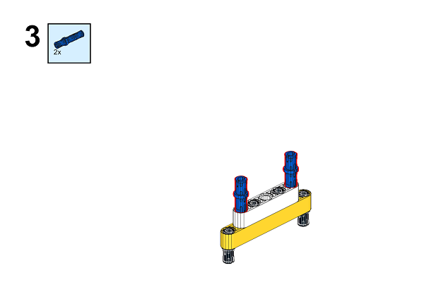
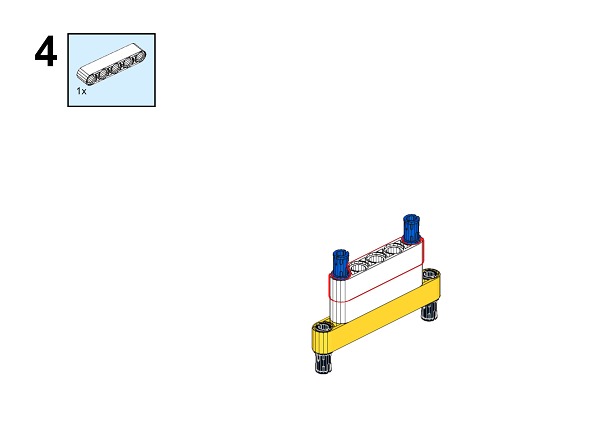
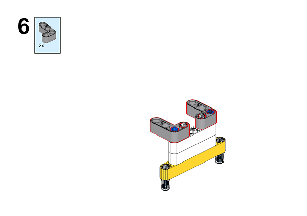
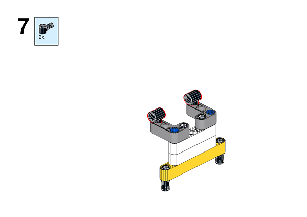
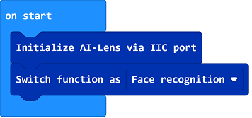
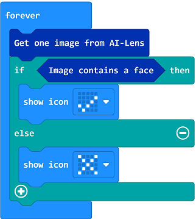

# Cutebot & AI Lens- Face Tracking

## Purpose
---
- Use the Cutebot and [AI Lens](https://www.elecfreaks.com/elecfreaks-smart-ai-lens-kit.html) to achieve the face tracking function.

## Materials required
---

- 1 × [Cutebot V3.0](https://www.elecfreaks.com/micro-bit-smart-cutebot.html)

- 1 × [Cutebot lithium battery pack](https://www.elecfreaks.com/cutebot-lithium-battery-pack.html)

- 1 × [AI Lens Kit](https://www.elecfreaks.com/elecfreaks-smart-ai-lens-kit.html)

***Note:*** The [AI Lens](https://www.elecfreaks.com/elecfreaks-smart-ai-lens-kit.html) kit works with [Cutebot](https://www.elecfreaks.com/micro-bit-smart-cutebot.html) V3.0 only(You can see the version number printed on the baseboard).

## Connections:
---

### Steps to install the lithium battery pack:

Assembly steps for bricks:

Parts list:

Steps of build-up:

### Connections of the AI Lens:

Connect the RJ11 cable with the [AI Lens](https://www.elecfreaks.com/elecfreaks-smart-ai-lens-kit.html) and the other end in Dupont connection to the circled place in the below picture (make sure you connect to the right connections).

***Tips:*** the bricks holder here is flexible to be adjusted, we may manually adjust the angles of the [AI Lens](https://www.elecfreaks.com/elecfreaks-smart-ai-lens-kit.html) to meet the requirements of the functions that you want to achieve.

## Software Platform:
---

[MicroSoft MakeCode](https://makecode.microbit.org/#)

## Programming
---

### Step 1

Click “Advanced” in the drawer to see more choices.

- We need to add a package for programming. Click “Extensions” in the bottom of the drawer and search with “cutebot” in the dialogue box to download it.

We need to add a package for programming the [AI Lens](https://www.elecfreaks.com/elecfreaks-smart-ai-lens-kit.html) kit. Click “Extensions” in the bottom of the drawer and search with “https://github.com/elecfreaks/pxt-PlanetX-AI” in the dialogue box to download it.

***Note:*** If you met a tip indicating that the codebase will be deleted due to incompatibility, you may continue as the tips say or build a new project in the menu.

###  Step 2

- In the on start brick, initialize the [AI Lens](https://www.elecfreaks.com/elecfreaks-smart-ai-lens-kit.html) and switch to face recognition function.

- In the “forever” brick, set to get one image form the [AI Lens](https://www.elecfreaks.com/elecfreaks-smart-ai-lens-kit.html). If a face is on the image, set the LED screen to display √; or set to display ×.

### Link

Link: [https://makecode.microbit.org/_KFMLijP1xdh5](https://makecode.microbit.org/_KFMLijP1xdh5)

You may also download it directly below:

    <iframe
        src="https://makecode.microbit.org/_KFMLijP1xdh5"
        frameborder="0"
        sandbox="allow-popups allow-forms allow-scripts allow-same-origin"
        style={{
            position: 'absolute',
            width: '100%',
            height: '100%',
        }}
    />

## Result
---
- If the [AI Lens](https://www.elecfreaks.com/elecfreaks-smart-ai-lens-kit.html) recognizes the face(s), the LED screen displays √; or it displays ×.

## Exploration
---

## FAQ
---

## Relevant Files
---
