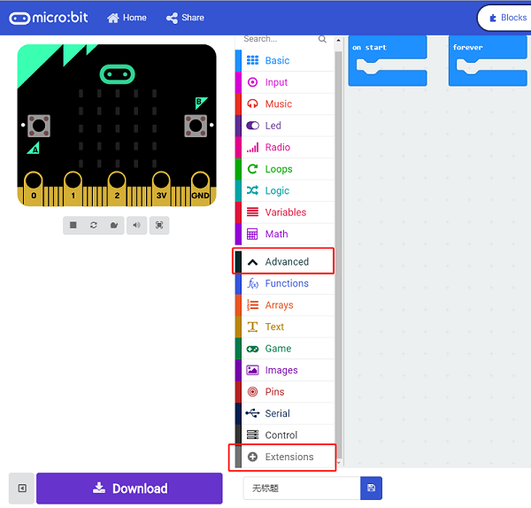
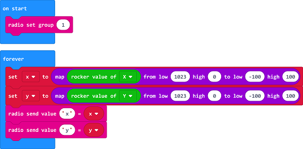
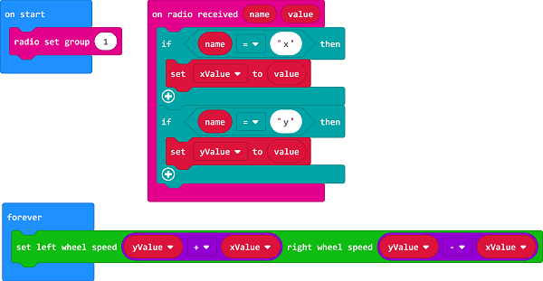

# Case 13: Remote Control with Joystick:bit

## Purpose
---
- Use the joystick:bit to control the [Cutebot](https://shop.elecfreaks.com/products/elecfreaks-micro-bit-smart-cutebot-kit-without-micro-bit-board?_pos=1&_sid=4c6909119&_ss=r).

## Materials
---
- 1 x [Cutebot Kit](https://shop.elecfreaks.com/products/elecfreaks-micro-bit-smart-cutebot-kit-without-micro-bit-board?_pos=1&_sid=4c6909119&_ss=r)
- 1 x [Joystick:bit V2](https://shop.elecfreaks.com/products/elecfreaks-micro-bit-joystick-bit-v2-kit?_pos=2&_sid=72f08b2c2&_ss=r)

## Software Platform
---
[MicroSoft makecode](https://makecode.microbit.org/#)

## Programming
---

### Step 1

- Click the "Advanced" to see more choices in the MakeCode drawer.

- A codebase is required for [Cutebot](https://shop.elecfreaks.com/products/elecfreaks-micro-bit-smart-cutebot-kit-without-micro-bit-board?_pos=1&_sid=4c6909119&_ss=r) programming, click “Add Package” at the bottom of the drawer, search `Cutebot` in the dialogue box and download it.

- A codebase is required for [Joystick:bit V2](https://www.elecfreaks.com/joystick-bit-2-for-micro-bit.html) programming, click “Add Package” at the bottom of the drawer, search `joystic` in the dialogue box and download it.
-

***Note:*** If you met a tip indicating incompatibility of the codebase, you can continue with the tips or build a new project there.

### Step 2: Joystick:bit Programming

- Set "radio set group" to `1` in the `On start` brick.
- The scope for `X` and `Y` is `0~1023`, the theoretical value is `512`  if the rocker is in the middle place , in this way we need to make 0~1023 `map` map in the scope of `-100~100`.
- Set `x` whose value is given by "acceleration (mg) x" exactly divides `10` to the radio value in `forever` brick.
- Set `y` whose value is given by "acceleration (mg) y" exactly divides `10` to the radio value in `forever` brick.
- The scope of the acceleration value is `0`~`1024` , which can be regarded roughly as the speed value in `0`~`100` after dividing `10`.

### Programming

Links: [https://makecode.microbit.org/_cVWKfb09E5st](https://makecode.microbit.org/_cVWKfb09E5st)

You can also download it directly below:

    <iframe
        src="https://makecode.microbit.org/_cVWKfb09E5st"
        frameborder="0"
        sandbox="allow-popups allow-forms allow-scripts allow-same-origin"
        style={{
            position: 'absolute',
            width: '100%',
            height: '100%',
        }}
    />

### Step 3: Cutebot Programming

- Set the "radio set group" to `1` in the `On start` brick. Items must be the same with the remote control for the correct match.
- Drag two "if" bricks into the `on radio received` brick and judge if the radio revived value `name` is `x` or `y`
- If the radio received value `name` is `x`, it is the data for `X` and then save the `value` in the variable `xValue`.
- If the radio received value `name` is `y`, it is the data for `y` and then save the `value` in the variable `yValue`.
- In `forever` brick, set the left wheel speed to `yValue`+`xValue` and right wheel speed to `yValue`-`xValue`.

### Programming

Links: [https://makecode.microbit.org/_WDpVxaeTXdLT](https://makecode.microbit.org/_WDpVxaeTXdLT)

You can also download it directly below:

    <iframe
        src="https://makecode.microbit.org/_WDpVxaeTXdLT"
        frameborder="0"
        sandbox="allow-popups allow-forms allow-scripts allow-same-origin"
        style={{
            position: 'absolute',
            width: '100%',
            height: '100%',
        }}
    />

## Result
---
- The rocker controls the movement of the [Cutebot](https://shop.elecfreaks.com/products/elecfreaks-micro-bit-smart-cutebot-kit-without-micro-bit-board?_pos=1&_sid=4c6909119&_ss=r).

## Exploration
---

## FAQ
---

## Relevant Files
---
