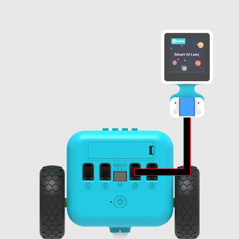

# Case 23: Face-tracking with TPBot

## Purpose
---
- Build a face-tracking TPBot with the Smart AI Lens.

## Materials required
---

- 1 x [TPBot](https://shop.elecfreaks.com/products/elecfreaks-micro-bit-tpbot-car-kit-without-micro-bit-board?_pos=1&_sid=f32828112&_ss=r)


- 1 x  [AI Lens](https://shop.elecfreaks.com/products/elecfreaks-smart-ai-lens-kit?_pos=1&_sid=068025047&_ss=r)


## Hardware Connections
---
Connect the AI Lens to the IIC port on TPBot.



## Software
---

[MicroSoft MakeCode](https://makecode.microbit.org/#)


## MakeCode Programming
---


- Click "Advanced" to see more choices in the MakeCode drawer.


- We need to add a package for programming. Click "Extensions" in the bottom of the drawer and seach with "tpbot" in the dialogue box to download it.


- We need to add a package for programming the AI Lens kit. Click "Extensions" in the bottom of the drawer and seach with `https://github.com/elecfreaks/pxt-PlanetX-AI` in the dialogue box to download it.


### Sample Code

- Initialize the AI lens kit in the On start brick and switch its function to face recognition.


- In forever brick, get an image from the AI lens and adjust TPBot' direction by the face recognized in the lens.


- Complete code:


### Reference
- Link: [https://makecode.microbit.org/_i4aLd1MvADLU](https://makecode.microbit.org/_i4aLd1MvADLU)

- You may also download it directly here:

<div
    style={{
        position: 'relative',
        paddingBottom: '60%',
        overflow: 'hidden',
    }}
>
    <iframe
        src="https://makecode.microbit.org/_i4aLd1MvADLU"
        frameborder="0"
        sandbox="allow-popups allow-forms allow-scripts allow-same-origin"
        style={{
            position: 'absolute',
            width: '100%',
            height: '100%',
        }}
    />
</div>


## Python Programming
---
Add TPBot extension: [https://www.elecfreaks.com/learn-cn/microbitKit/TPbot_tianpeng/TPbot-python.html](https://www.elecfreaks.com/learn-cn/microbitKit/TPbot_tianpeng/TPbot-python.html)

Add AI Lens extension: [https://www.elecfreaks.com/learn-cn/microbitplanetX/ai/Plant-X-EF05035-python.html](https://www.elecfreaks.com/learn-cn/microbitplanetX/ai/Plant-X-EF05035-python.html)

### Code

```
# Add your Python code here. E.g.
from microbit import *
from AILens import *
from TPBot import *

tp = TPBOT()
ai = AILENS()
# Set the function of AI Lens in face recognition
ai.switch_function(Face)

while True:
    # Get an image
    ai.get_image()

    buff = ai.get_face_data()
    # "buff[0]"means the X coordinates data of the face detected in AI lens
    i = buff[0]
    if ( i < 80):
        tp.set_motors_speed(-30,0)
    elif ( i > 144):
        tp.set_motors_speed(0,-30)
    else:
        tp.set_motors_speed(0,0)
```

### Result

The TPBot changes its heading direction in accordance with the face the AI Lens detects.

## Exporation
---


## FAQ
---
Q: TPBot doesn't work with the sample code.
A: It is probably due to the lack of battery power, please try adding the speed of the TPBot or replacing with new batteries.
Q: The AI Lens is not working,  and it does not go to the function page with the sample code.
A: Please try replacing with new batteries.

## Relevant File
---
