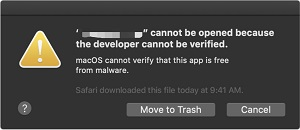

# AI Lens

## Introduction

The AI Lens is able to achieve the functions of face recognition, balls tracking, cards recognition and characteristics acquisition.

## Products Link

[ELECFREAKS Smart AI Lens Kit](https://shop.elecfreaks.com/products/elecfreaks-smart-ai-lens-kit?_pos=1&_sid=d572dc26c&_ss=r)

## Characteristics

 Designed with RJ11 connection and easy to plug.

## Specification

|      Item       | Parameter |
| :---------: | :---------: |
|       SKU       |  EF05045  |
|   Connection    |   RJ11    |
| Connection Type |    IIC    |
| Working Voltage |   3.3V    |
|     Core IC     |   K210    |

The origin point of the AI Lens is on the left top corner (0,0), and the range of the coordinate X&Y is (0,224).

## Outlook and Dimension

## Connection Type: RJ11 to Dupont connector

While the micro:bit breakout board doesn’t have the RJ11 connections, we can choose to use a Dupont wire that has the RJ11 connections. We need to connect the RJ11 to the Lens and the other ends connect to the breakout board(Black wire to GND; Red to VCC; Green to P19(SCL); Yellow to P20(SDA)). If the Lens doesn’t work from the start, please try powering it with a standalone power sourse.

Take IoT:bit for an example:

***Note:***

1.  If you do not use Nezha expansion board to drive the AI Lens, please search with the package through: PlanetX-AI

2. Under the one button to acquire mode,  you will have to re-learn the objects if you restart the device. 

3. After downloading the code, if the AI lens gets stuck in the starting page with an init AI Lens error instruction, please try to power off the device and restart it. (Or make sure you connect the ready-programmed micro:bit board after the AI Lens connects the breakout board well )

## AI Lens firmware update

For a better experience of the AI Lens, we are making an irregularly update for the new functions and optimization of the performance, a manually update of the firmware is required after the new version is released. 

### How to check the current version

The current version number shall be displayed on the lower right corner of the boot screen(starting-on page), if there is no prompt, it should be the oldest version, please update asap. 

### Latest version firmware

firmware v1.0.12 [click to download](https://github.com/elecfreaks/learn-cn/raw/master/microbitplanetX/ai/v1.0.12.kfpkg)。

### The newest firmware version

1. First, installation of camera serial port driver

Windows system downloading [CH341SerSetup.exe](https://github.com/elecfreaks/learn-cn/raw/master/microbitplanetX/ai/CH341SerSetup.exe)

macOS system downloading [CH34x_Install_V1.5.pkg](https://github.com/elecfreaks/learn-cn/raw/master/microbitplanetX/ai/CH34x_Install_V1.5.pkg)

2. Install “kflash” for downloading the firmware.

Windows system downloading [kflash_gui_v1.6.5_2_windows.7z](https://github.com/elecfreaks/learn-cn/raw/master/microbitplanetX/ai/kflash_gui_v1.6.5_2_windows.7z) and unzipping it. 

macOS system downloading [kflash_gui_v1.6.5_2_macOS.dmg](https://github.com/elecfreaks/learn-cn/raw/master/microbitplanetX/ai/kflash_gui_v1.6.5_2_macOS.dmg) 

For windows system, open the file folder kflash_gui and find kflash_gui.exe.

For macOS system, click the icon of kflash_gui after the downloading. 

Double click kflash_gui.exe to open the file and choose to open the newest firmware.

Connect the AI Lens with the USB wire. 

Choose the port to download it. 

### FAQ

1.In macOS operation system, if you fail to install the firmware because the developer cannot be verified. 

Please visit https://support.apple.com/en-us/HT202491 for solutions.

2.While using AI cameras, if there is an error tip occurring while clicking downloading, it might be the corrupted extensions of the PlanetX. 

Details of the corrupted might be these two reasons: 

(1)The version of the extension is not the newest, please try creating a new project and add the extensions again. 

(2)The conflict emerged due the adding of both the PlanetX and PlanetX-AI, please click the part circled in red in the picture “JaveScript”to switch the program screen, click the explorer and delete PlanetX or PlanetX-AI according to your demand. 

After deleting, it should work now. 

After deleting, if you find the loss of the visual block, please try adding the extensions again. If it doesn’t work, please try resetting the MakeCode with the tips in below picture. 

***Note:*** all projects saved in MakeCode will be cleared after the reset, please save all of them in your computer if you need them. 

