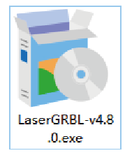
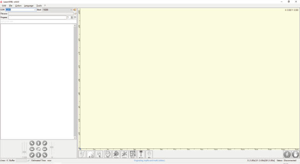
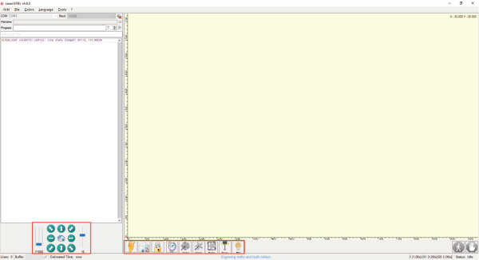
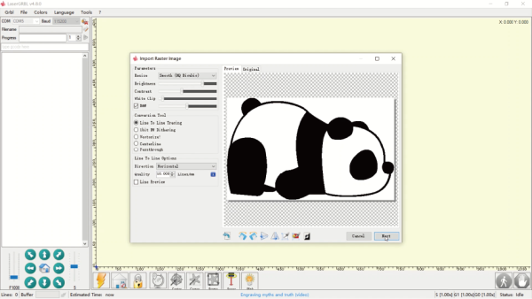
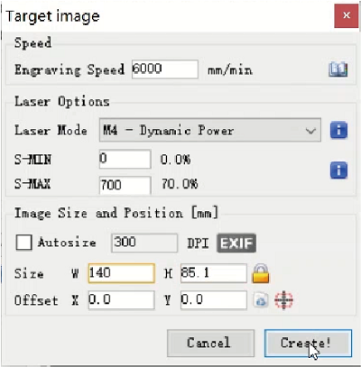
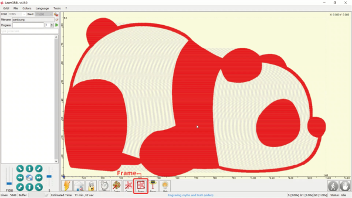
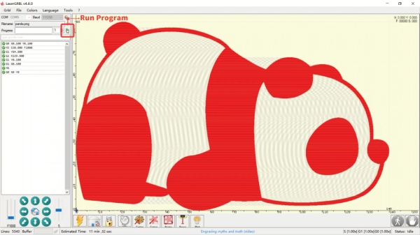

# LaserGRBL User Guide

Use a dust-free cloth with alcohol to wipe the protective lens of the laser module before engraving to ensure the best engraving effect.

Place the wooden board in the working area of TOOCA Laser 1, put down the fixing strip and loosen the screw on the side of the laser module for focusing.

The fixed focus bar should be in contact with the surface of the engraving material when it is naturally vertically downward. Use the screw on the right side to fasten it, and turn the fixed focus bar clockwise until it is attracted by the magnet. Finally plug in the laser module line.

**Attention: In order to protect the table or floor from being burned or smoked, please protect the worktable well(use materials such as padding steel plates and other materials that are not easily penetrated by lasers). When doing the laser cutting, the bottom surface of the cutting place should be suspended to ensure the cutting effect.
**

## LaserGRBL Software Manual

Double-click the .exe file to install LaserGRBL. If it cannot be installed, visit
https://lasergrbl.com/download/ to download the appropriate version.

Double-click it to open the app, power on the device and turn on the red switch. Use Type-C data cable to connect the computer and the machine after completing initialization. Select the corresponding COM and set Baud to 115200.

Click "Connect".

Some icons will light up after the connection.

Attention: If it fails to connect, long press the micro switch of the machine for 3 seconds and quickly click “connect” when you hear the second "beep".

Click ”Homing”.

Click "File-Append File" to import picture. Set the effect and click "Next". Recommended parameters for matching basswood: S-MIN - 0 S-MAX - 700; Engraving Speed - 6000.

NOTES: Higher power % or slower speed makes deeper effect; lower power % or faster speed makes shallower effect. Generally we can just adjust S-MAX and you should enter a ten times value of power percentage. For example: to set 70% power, you should enter 700, not 70.

Set the Laser Mode to M4. Set the appropriate power %, speed, size and position of picture, etc. Click “Create“.

Notes: For more details of power rate, speed and times, please can visit: [Recommended parameters](http://www.elecfreaks.com/learn-en/tooca-laser-1/recommended-parameters.html).

6. Click "Frame" to enter previewing mode. At this time, the laser module will emit weak light and move around the maximum X and Y edges of the processed image. At this time, the material can be adjusted to the appropriate position.

7. Finally click "Run Program" to start engraving. For more details please refer to: https://lasergr bl.com/usage/

Besides these references, you can also connect the machine with Type-C to do real-time engrave, for more details please can visit:
https://lightburnsoftware.github.io/NewDocs/

Notes: The gcode file generated by LaserGRBL does not contain frame-previewing information, which will make it inconvenient to locate. It is not recommended to use TF card for offline engraving when using LaserGRBL. Please refer to LightBurn User Guide for offline engraving.
